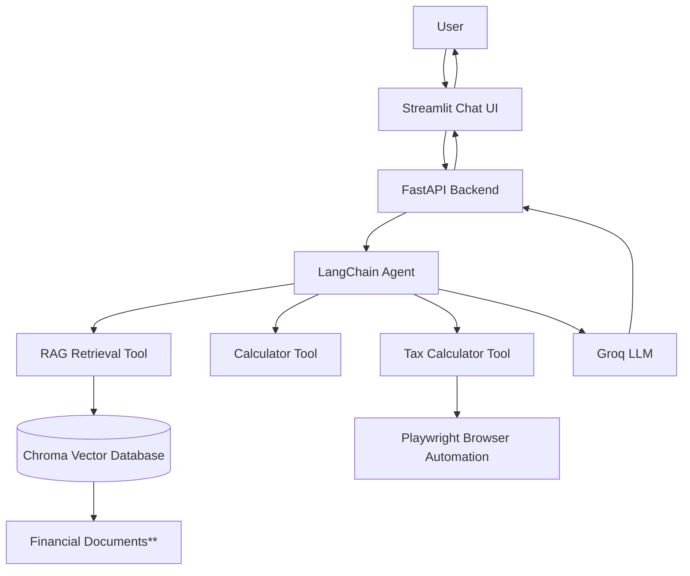

Check out the configuration reference at https://huggingface.co/docs/hub/spaces-config-reference

# FinSense AI – Financial Policy Assistant


FinSense AI is an **agentic Retrieval-Augmented Generation (RAG) application** that helps individuals understand financial policies such as savings schemes, tax rules, and government budget updates.

The system retrieves information from official Indian policy documents, performs calculations when needed, and explains how financial policies affect an individual user.

This project demonstrates **end-to-end GenAI system development**, including RAG pipelines, tool-using agents, API development, containerization, and deployment-ready architecture. 

This project was developed to explore core concepts in Generative AI and Agentic AI, including Retrieval-Augmented Generation (RAG), tool-using agents, and production-style AI system design.

Please [visit here](https://finsense-ai.streamlit.app/) for a live demo of the project. 

The frontend (UI) has been deployed on StreamlitCloud with the backend (API) on a HuggingFace space. 
It uses a free GROQ API key, so please visit sometime later as API free usage might have been temporarily reached.

---

## Features

* Agentic RAG system for financial questions
* Retrieval from official financial documents using a vector database
* Tool-based reasoning (calculator and tax-related logic)
* FastAPI backend for production-style API usage
* Streamlit chat interface
* Structured logging for debugging and monitoring
* Dockerized backend for reproducible deployment

---

## System Architecture


Agent Tools:

* RAG Retrieval Tool (ChromaDB)
* Calculator Tool
* Tax Calculation Tool

The agent retrieves relevant policy documents, optionally uses tools for computation, and generates the final answer using an LLM.

** The financial documents currently include an official PDF with the latest highlights of the Indian budget and a text document detailing various Indian post office savings schemes. 

---

## Tech Stack

**AI / ML**

* LangChain
* Sentence Transformers
* Chroma Vector Database
* Groq LLM

**Backend**

* FastAPI
* Python

**Frontend**

* Streamlit

**Infrastructure**

* Docker

---
## Engineering Highlights

This project was designed to resemble a **near-production AI service** rather than a simple notebook prototype.

Key engineering aspects include:

* **Agentic RAG Architecture**
  The system uses a tool-enabled agent that retrieves documents, performs calculations, and synthesizes responses.

* **Vector Retrieval Pipeline**
  Financial policy documents are embedded using Sentence Transformers and stored in a Chroma vector database for semantic retrieval.

* **Tool-based Reasoning**
  The agent dynamically decides when to use tools such as:

  * knowledge retrieval
  * tax calculations using a [web-based official tax calculator](https://incometaxindia.gov.in/Pages/tools/tax-calculator.aspx)

* **API-first Backend**
  The application is served through a FastAPI backend, allowing it to be accessed by different clients (UI, Postman, or other services).

* **Structured Logging**
  Logging is implemented across API calls and tool executions to track system behavior and aid debugging.

* **Containerized Deployment**
  The backend is packaged using Docker to ensure reproducibility and simplify deployment across environments.

* **Separation of UI and Backend**
  The chat interface (Streamlit) communicates with the backend API, mirroring real-world service architecture. I have also kept APIs stateless by storing the current chat in the UI itself. This allows us to send the whole context so far, in each new API call, without increasingthe  load on the server with storage and loading.
  
These design decisions help simulate how modern **LLM-powered applications are built and deployed in production environments**.

---

## Project Structure

```
finsense/
│
├── src/
│   ├── api.py
│   ├── agent.py
│   ├── logger.py
│   └── tools/
│       ├── rag_tool.py
│       └── calculator_tool.py
│
├── chroma_db/
├── ui/
│   └── app.py
│
├── requirements.txt
├── Dockerfile
└── README.md
```

---

## Running the Project

### 1. Clone the repository

```
git clone https://github.com/your-username/finsense.git
cd finsense
```

---

### 2. Set Environment Variables

Create a `.env` file:

```
GROQ_API_KEY=your_api_key_here
HUGGINGFACEHUB_API_TOKEN=your_api_key_here
```

---

### 3. Run Backend with Docker

Build the container:

```
docker build -t finsense-api .
```

Run the container:

```
docker run -p 8000:8000 --env-file .env finsense-api
```

API will be available at:

```
http://localhost:8000
```

---

### 4. Test the API

Open FastAPI Swagger UI:

```
http://localhost:8000/docs
```

Example request:

```
POST /chat
```

```json
{
  "messages": [
    {
      "role": "user",
      "content": "What is PPF?"
    }
  ]
}
```

---

### 5. Run Streamlit UI

```
cd ui
streamlit run app.py
```

---

## Example Queries

* What is PPF?
* Explain the benefits of Public Provident Fund
* Which tax regime is better for ₹12 lakh salary?
* What is the difference between 120000 and 90000?

---

## Key Concepts Demonstrated

* Retrieval-Augmented Generation (RAG)
* Agent-based tool usage
* Vector databases for knowledge retrieval
* LLM orchestration with LangChain
* Production-style API design
* Containerization with Docker

---

## Future Improvements

* Reduce hallucinations and implement RAG evaluation with RAGAS
* Automated document updates for policy changes
* Multi-chat support
* Document versioning
* Response caching
* User authentication and multi-user support
* Multi-agent complex workflows with memory using LangGraph.

---

## License

This project is built for educational and portfolio purposes.
